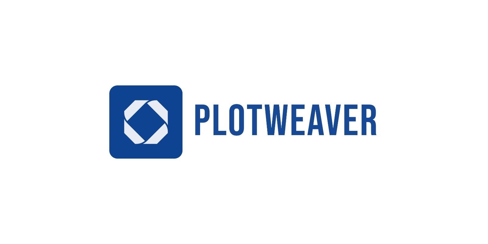

# Plotweaver AI Docs

Plotweaver is an AI-powered end-to-end film production and narrative platform designed to bridge the gap between creative vision and global commercial viability. By integrating cultural intelligence with cutting-edge Large Language Models (LLMs), Plotweaver empowers filmmakers, screenwriters, and content creators to build authentic, high-quality narratives that resonate across borders.

### Why Plotweaver?

Most AI voice systems collapse outside English and a handful of European languages. PlotWeaver is built differently — as long-term infrastructure, not a one-language demo.

- Optimised for reliability, long-form stability, and real-world deployment — not viral clips or short demos.
- 
- Models trained on datasets collected via institutional university and cultural partnerships, with full informed consent.
 
- Each language is a first-class system with its own phonology, tonal modelling, and independent evaluation benchmarks.
 
- Already deployed in film, education, and public-sector pipelines. Built for teams moving from research to production.

## Support 
Please Contact Support through 